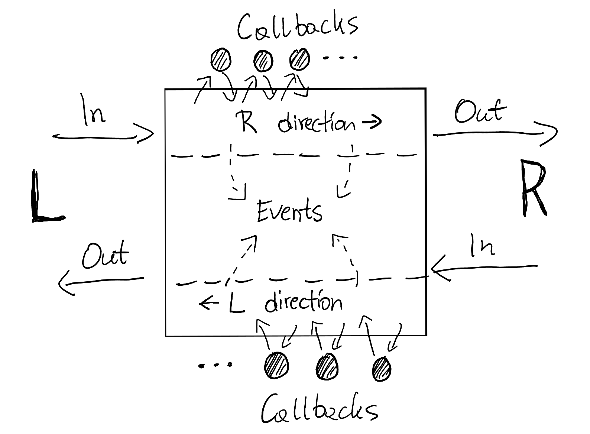

 # BGPFix Golang Library

[](https://pkg.go.dev/github.com/bgpfix/bgpfix)

**WORK IN PROGRESS PREVIEW 09/2023**

A generic-purpose, high-performance Golang library for [bridging the gaps in BGP](https://twitter.com/ACM_IMC2021/status/1445725066403196928).

The main idea is it can "fix" or "extend" BGP sessions in-flight, possibly adding new features or protection layers to proprietary BGP speakers (think big router vendors). As an example, the vision is it can be used to implement:
 * bidirectional BGP session to JSON translation, replacing [exabgp](https://github.com/Exa-Networks/exabgp/) for some use-cases,
 * transparent BGP proxy, optionally rewriting the messages in-flight,
 * streaming MRT files to BGP routers, adding the necessary OPEN negotiation beforehand,
 * Flowspec firewalls using [Linux Netfilter](https://netfilter.org/),
 * passive inspection (and storage) of ongoing BGP sessions, like in [tcpdump](https://www.tcpdump.org/),
 * cool new BGP extensions for legacy speakers, eg. [RPKI](https://en.wikipedia.org/wiki/Resource_Public_Key_Infrastructure) and [ASPA](https://www.manrs.org/2023/02/unpacking-the-first-route-leak-prevented-by-aspa/) validation, [Only To Customer (OTC)](https://www.manrs.org/2023/04/there-is-still-hope-for-bgp-route-leak-prevention/) attribute, or even [BGPSec](https://en.wikipedia.org/wiki/BGPsec),
 * protecting from [grave flaws in BGP error handling](https://blog.benjojo.co.uk/post/bgp-path-attributes-grave-error-handling) (and possibly other flaws found using [recent BGP fuzzing projects](https://github.com/Forescout/bgp_boofuzzer))
 * academic research ideas, eg. [Pretty Good BGP](https://www.cs.princeton.edu/~jrex/papers/pgbgp.pdf) or protection against [distributed prefix de-aggregation attacks](https://arxiv.org/abs/2210.10676).

If you're interested in bgpfix, you might also want to see:
 * [exabgp](https://github.com/Exa-Networks/exabgp/) (of course)
 * [corebgp](https://github.com/jwhited/corebgp)
 * [xBGP](https://www.usenix.org/conference/nsdi23/presentation/wirtgen)

# Idea

The overall idea is presented below. You don't need to use the whole library, eg. you may stick to the basic [BGP message marshal / unmarshal procedures](https://pkg.go.dev/github.com/bgpfix/bgpfix@master/msg).



The above explains the concept of a [Pipe](https://pkg.go.dev/github.com/bgpfix/bgpfix@master/pipe#Pipe): it has two *directions* used to exchange BGP messages between 2 speakers on the left (L) and right (R) hand side of the picture.

Each [Msg](https://pkg.go.dev/github.com/bgpfix/bgpfix@master/msg#Msg) sent to the [In](https://pkg.go.dev/github.com/bgpfix/bgpfix@master/pipe#Direction) channel of a particular direction will go through a set of *callbacks* (think "plugins") configured in the [pipe Options](https://pkg.go.dev/github.com/bgpfix/bgpfix@master/pipe#Options). Each callback can read, write, modify, synthesize, or drop messages before they reach the Out channel. In addition to BGP messages, callbacks may emit [Events](https://pkg.go.dev/github.com/bgpfix/bgpfix@master/pipe#Event) - such as [the standard events of the Pipe](https://pkg.go.dev/github.com/bgpfix/bgpfix@master/pipe#pkg-variables) - which [event handlers may subscribe to](https://pkg.go.dev/github.com/bgpfix/bgpfix@master/pipe#Options.OnEvent) in the pipe Options.

# Example

A basic example on how to establish a BGP session with a router, and print all messages as JSON to stdout:

```go
package main

import (
	"context"
	"fmt"
	"net"
	"net/netip"

	"github.com/bgpfix/bgpfix/msg"
	"github.com/bgpfix/bgpfix/pipe"
	"github.com/bgpfix/bgpfix/speaker"
	"github.com/bgpfix/bgpfix/util"
)

func main() {
	// create a BGP pipe, enable timestamps
	p := pipe.NewPipe(context.Background())
	p.Options.Tstamp = true

	// add our callback and event handlers
	p.Options.OnMsg(print, 0) // call print() on every BGP message in L or R direction
	p.Options.OnEvent(event)  // call event() on any pipe event

	// attach a BGP speaker
	spk := speaker.NewSpeaker(context.Background())
	spk.Options.Passive = false
	spk.Options.LocalASN = 65055
	spk.Options.LocalId = netip.MustParseAddr("1.1.1.1")
	spk.Attach(p)             // attach spk to p using callbacks

	// dial the target
	conn, err := net.Dial("tcp", os.Args[1]) // assumes a ":179" suffix
	if err != nil {
		panic(err)
	}

	// 1. read from conn -> write to p.R.In
	// 2. read from p.L.Out -> write to conn
	util.CopyThrough(p, conn, nil)
}

func print(m *msg.Msg) pipe.Action {
	fmt.Printf("%s\n", m.ToJSON(nil))
	return 0
}

func event(ev *pipe.Event) bool {
	switch ev.Type {
	case pipe.EVENT_OPEN:
		fmt.Printf("OPEN sent and received, caps=%s", p.Caps.ToJSON(nil))
	}
	return true
}
```

# JSON

bgpfix has full, bidirectional BGP to JSON translation support.

For example, below we connect to the Flowspec version of the great [BGP Blackholing project](https://lukasz.bromirski.net/bgp-fs-blackholing/) by [@LukaszBromirski](https://twitter.com/LukaszBromirski):
```
pjf@pjf:~/bgp2json$ ./bgp2json -active -asn 65055 85.232.240.180:179 | jq .
[
  "2023-08-18T11:33:41.298",
  1,
  "L",
  "OPEN",
  -1,
  {
	"bgp": 4,
	"asn": 65055,
	"id": "0.0.0.1",
	"hold": 90,
	"caps": {
	  "MP": [
		"IPV4/UNICAST",
		"IPV4/FLOWSPEC",
		"IPV6/UNICAST",
		"IPV6/FLOWSPEC"
	  ],
	  "ROUTE_REFRESH": true,
	  "EXTENDED_MESSAGE": true,
	  "AS4": 65055
	}
  }
]
[
  "2023-08-18T11:33:41.324",
  1,
  "R",
  "OPEN",
  56,
  {
	"bgp": 4,
	"asn": 65055,
	"id": "85.232.240.180",
	"hold": 7200,
	"caps": {
	  "MP": [
		"IPV4/FLOWSPEC"
	  ],
	  "ROUTE_REFRESH": true,
	  "EXTENDED_NEXTHOP": [
		"IPV4/UNICAST/IPV6",
		"IPV4/MULTICAST/IPV6",
		"IPV4/MPLS_VPN/IPV6"
	  ],
	  "AS4": 65055,
	  "PRE_ROUTE_REFRESH": true
	}
  }
]
[
  "2023-08-18T11:33:41.325",
  2,
  "L",
  "KEEPALIVE",
  0,
  null
]
[
  "2023-08-18T11:33:41.348",
  2,
  "R",
  "KEEPALIVE",
  0,
  null
]
[
  "2023-08-18T11:33:46.352",
  3,
  "R",
  "UPDATE",
  316,
  {
	"attrs": {
	  "ORIGIN": {
		"flags": "T",
		"value": "IGP"
	  },
	  "ASPATH": {
		"flags": "T",
		"value": []
	  },
	  "LOCALPREF": {
		"flags": "T",
		"value": 100
	  },
	  "ORIGINATOR": {
		"flags": "O",
		"value": "85.232.240.170"
	  },
	  "CLUSTER_LIST": {
		"flags": "O",
		"value": [
		  "85.232.240.180"
		]
	  },
	  "MP_REACH": {
		"flags": "OX",
		"value": {
		  "af": "IPV4/FLOWSPEC",
		  "nexthop": "192.0.2.1",
		  "rules": [
			{
			  "SRC": "2.59.255.53/32",
			  "PROTO": [
				{
				  "op": "==",
				  "val": 6
				}
			  ],
			  "PORT_DST": [
				{
				  "op": "==",
				  "val": 25
				}
			  ]
			},
			/*** ... cut many lines ... ***/
		  ]
		}
	  },
	  "EXT_COMMUNITY": {
		"flags": "OT",
		"value": [
		  {
			"type": "FLOW_RATE_BYTES",
			"value": 0
		  }
		]
	  }
	}
  }
]
[
  "2023-08-18T11:33:46.455",
  9,
  "R",
  "UPDATE",
  10,
  {
	"attrs": {
	  "MP_UNREACH": {
		"flags": "O",
		"value": {
		  "af": "IPV4/FLOWSPEC",
		  "rules": []
		}
	  }
	}
  }
]

```

# Supported RFCs (incl. partial/wip support)

 * [RFC1997 BGP Communities Attribute](https://datatracker.ietf.org/doc/html/rfc1997)
 * [RFC2918 Route Refresh Capability for BGP-4](https://datatracker.ietf.org/doc/html/rfc2918)
 * [RFC4360 BGP Extended Communities Attribute](https://datatracker.ietf.org/doc/html/rfc4360)
 * [RFC4271 A Border Gateway Protocol 4 (BGP-4)](https://datatracker.ietf.org/doc/html/rfc4271)
 * [RFC4456 BGP Route Reflection: An Alternative to Full Mesh Internal BGP (IBGP)](https://datatracker.ietf.org/doc/html/rfc4456)
 * [RFC4760 Multiprotocol Extensions for BGP-4](https://datatracker.ietf.org/doc/html/rfc4760)
 * [RFC5492 Capabilities Advertisement with BGP-4](https://datatracker.ietf.org/doc/html/rfc5492)
 * [RFC5668 4-Octet AS Specific BGP Extended Community](https://datatracker.ietf.org/doc/html/rfc5668)
 * [RFC6793 BGP Support for Four-Octet Autonomous System (AS) Number Space](https://datatracker.ietf.org/doc/html/rfc6793)
 * [RFC8092 BGP Large Communities Attribute](https://datatracker.ietf.org/doc/html/rfc8092)
 * [RFC8654 Extended Message Support for BGP](https://datatracker.ietf.org/doc/html/rfc8654)
 * [RFC8950 Advertising IPv4 Network Layer Reachability Information (NLRI) with an IPv6 Next Hop](https://datatracker.ietf.org/doc/html/rfc8950)
 * [RFC8955 Dissemination of Flow Specification Rules](https://datatracker.ietf.org/doc/html/rfc8955)
 * [RFC8956 Dissemination of Flow Specification Rules for IPv6](https://datatracker.ietf.org/doc/html/rfc8956)
 * [draft-simpson-idr-flowspec-redirect BGP Flow-Spec Extended Community for Traffic Redirect to IP Next Hop](https://datatracker.ietf.org/doc/html/draft-simpson-idr-flowspec-redirect-02)
 * [RFC9072 Extended Optional Parameters Length for BGP OPEN Message](https://datatracker.ietf.org/doc/html/rfc9072)

# Author

Pawel Foremski [@pforemski](https://twitter.com/pforemski) 2023
